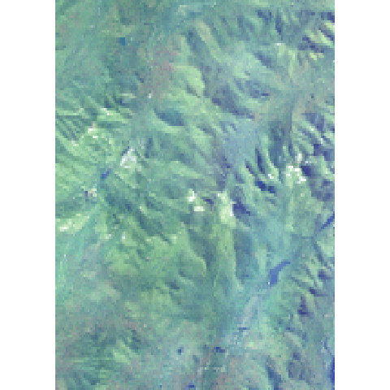
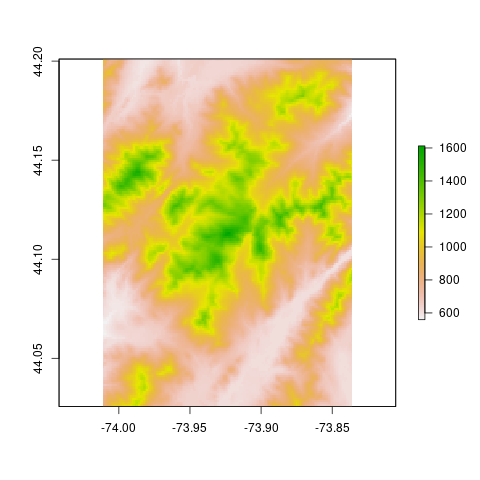

<!-- README.md is generated from README.Rmd. Please edit that file -->

```{r, include = FALSE}
knitr::opts_chunk$set(
  collapse = TRUE,
  comment = "#>",
  fig.path = "man/figures/README-",
  out.width = "100%"
)
```

# terrainr <a href='https://mikemahoney218.github.io/terrainr/'></a>

<!-- badges: start -->
[](https://choosealicense.com/licenses/mit/)
[](https://CRAN.R-project.org/package=terrainr)
[](https://www.tidyverse.org/lifecycle/#maturing)
[](https://travis-ci.com/mikemahoney218/terrainr)
[](https://ci.appveyor.com/project/mikemahoney218/terrainr)
[](https://codecov.io/gh/mikemahoney218/terrainr)
[](https://www.repostatus.org/#active)
<!-- badges: end -->

## Overview

terrainr makes it easy to identify your area of interest from point data, 
retrieve data for that area from the National Map API, and then process that 
data into larger, joined images or crop it into tiles that can be imported into 
the Unity rendering engine.

At the absolute simplest level, terrainr provides a convenient and consistent 
API to downloading data from the National Map. 

```{r eval=FALSE}
library(terrainr)
simulated_data <-  data.frame(id = seq(1, 100, 1),
                              lat = runif(100, 44.04905, 44.17609), 
                              lng = runif(100, -74.01188, -73.83493))

bbox <- get_coord_bbox(lat = simulated_data$lat, lng = simulated_data$lng) 
output_tiles <- get_tiles(bbox = bbox,
                          services = c("elevation", "ortho"))
```


```{r, eval = FALSE}
# output_tiles is now a list of two vectors pointing to the elevation and 
# orthoimagery tiles we just downloaded -- here we're displaying the first
# of the ortho tiles
raster::plot(raster::raster(output_tiles[[2]][[1]]))
```

```{r, echo = FALSE}
# that above plot leaves rmarkdown looking for a tempfile
# toss the actual image into man

```

Once downloaded, these images are in standard GeoTIFF or PNG formats and can be
used as expected with other utilities:

```{r eval=FALSE}
raster::plot(raster::raster(output_tiles[[1]][[1]]))elev
```

```{r, echo = FALSE}

```

Additionally, terrainr provides functions to transform these tiles into RAW 
images ready to be imported into the Unity rendering engine, allowing you to 
fly or walk through your downloaded data sets in 3D or VR:

```{r, results = FALSE, eval=FALSE}
merged_dem <- tempfile(fileext = ".tif")
merged_ortho <- tempfile(fileext = ".tif")
# we can call these vectors by name instead of position, too
merge_rasters(output_tiles$`3DEPElevation`, 
              merged_dem, 
              output_tiles$USGSNAIPPlus, 
              merged_ortho)

mapply(function(x, y) raster_to_raw_tiles(input_file = x, 
                                          output_prefix = tempfile(), 
                                          side_length = 4097, 
                                          raw = y),
       c(merged_dem, merged_ortho),
       c(TRUE, FALSE))

# With about ten minutes of movie magic (loading the files into Unity), 
# we can turn that into:
```

```{r echo=FALSE}
knitr::include_graphics("man/figures/unity-lakeside.jpg")
```

terrainr also includes functionality to merge and crop the files you've 
downloaded, and to resize your area of interest so you're sure to download 
exactly the area you want. Additionally, the more time intensive processing 
steps can all be monitored via the [progressr](https://github.com/HenrikBengtsson/progressr)
package, so you'll be more confident that your computer is still churning along
and not just hung. For more information, check out 
[the introductory vignette!](https://mikemahoney218.github.io/terrainr/articles/overview.html)

## Installation

You can install the development version of terrainr from [GitHub](https://github.com/mikemahoney218/terrainr) 
with:

``` r
# install.packages("devtools")
devtools::install_github("mikemahoney218/terrainr")
```

If you're planning on using `raster_to_raw_tiles()`, you'll also need to install
the development version of the `magick` package for the time being:

``` r
devtools::install_github("ropensci/magick")
```
