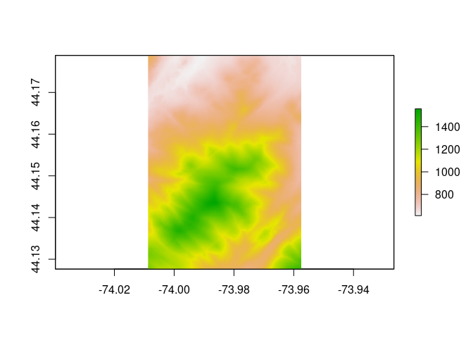

<!-- README.md is generated from README.Rmd. Please edit that file -->

# terrainr

<!-- badges: start -->

[](http://choosealicense.com/licenses/mit/)
[](https://CRAN.R-project.org/package=terrainr)
[](https://www.tidyverse.org/lifecycle/#maturing)
<!-- badges: end -->

## Overview

terrainr makes it easy to identify your area of interest from point
data, retrieve data for that area from the National Map API, and then
process that data into larger, joined images or crop it into tiles that
can be imported into the Unity rendering engine.

At the absolute simplest level, terrainr provides a convenient and
consistent API to downloading data from the National Map, currently
supporting downloading DEMs from the 3D Elevation Program and
orthoimages from the National Agriculture Imagery Program.

``` r
library(terrainr)
simulated_data <-  data.frame(id = seq(1, 100, 1),
                              lat = runif(100, 44.04905, 44.17609), 
                              lng = runif(100, -74.01188, -73.83493))

bbox <- get_coord_bbox(lat = simulated_data$lat, lng = simulated_data$lng) 
output_tiles <- get_tiles(bbox = bbox,
                          services = c("elevation", "ortho"))
```

``` r
# output_tiles is now a list of two vectors pointing to the elevation and 
# orthoimagery tiles we just downloaded -- here we're displaying the first
# of the ortho tiles
raster::plot(raster::raster(output_tiles[[2]][[1]]))
```


Once downloaded, these images are in standard GeoTIFF or PNG formats and
can be used as expected with other utilities:

``` r
raster::plot(raster::raster(output_tiles[[1]][[1]]))
```



Additionally, terrainr provides functions to transform these tiles into
RAW images ready to be imported into the Unity rendering engine,
allowing you to fly or walk through your downloaded data sets in 3D or
VR:

``` r
merged_dem <- tempfile(fileext = ".tif")
merged_ortho <- tempfile(fileext = ".tif")
# we can call these vectors by name instead of position, too
merge_rasters(output_tiles$`3DEPElevation`, 
              merged_dem, 
              output_tiles$USGSNAIPPlus, 
              merged_ortho)

mapply(function(x, y) raster_to_raw_tiles(input_file = x, 
                                          output_prefix = tempfile(), 
                                          side_length = 4097, 
                                          raw = y),
       c(merged_dem, merged_ortho),
       c(TRUE, FALSE))

# With about ten minutes of movie magic (loading the files into Unity), 
# we can turn that into:
```


terrainr also includes functionality to merge and crop the files you’ve
downloaded, and to resize your area of interest so you’re sure to
download exactly the area you want. Additionally, the more time
intensive processing steps can all be monitored via the
[progressr](https://github.com/HenrikBengtsson/progressr) package, so
you’ll be more confident that your computer is still churning along and
not just hung. For more information, check out [the introductory
vignette\!](https://mikemahoney218.github.io/terrainr/articles/overview.html)

## Installation

You can install the development version of terrainr from
[GitHub](https://github.com/mikemahoney218/terrainr) with:

``` r
# install.packages("devtools")
devtools::install_github("mikemahoney218/terrainr")
```

If you’re planning on using `raster_to_raw_tiles()`, you’ll also need to
install the development version of the `magick` package for the time
being:

``` r
devtools::install_github("ropensci/magick")
```
