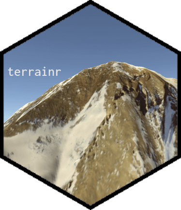
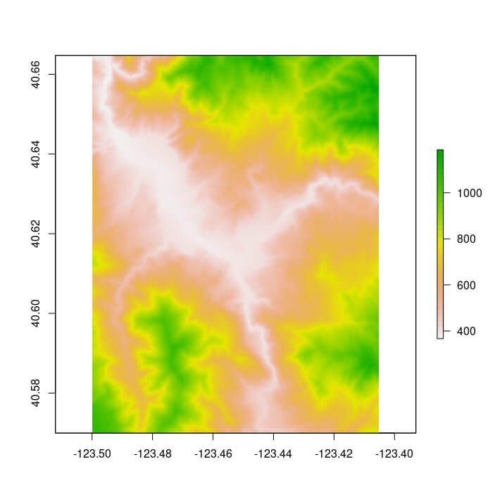
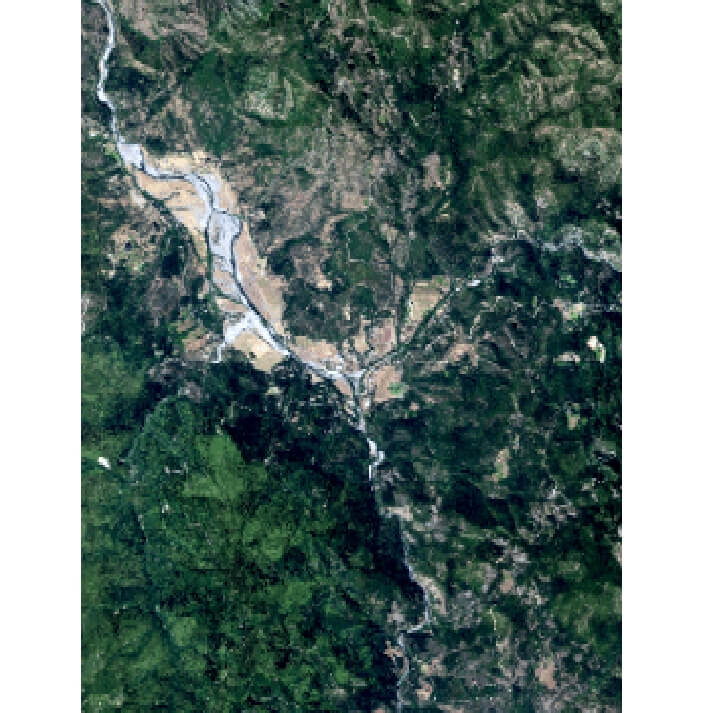
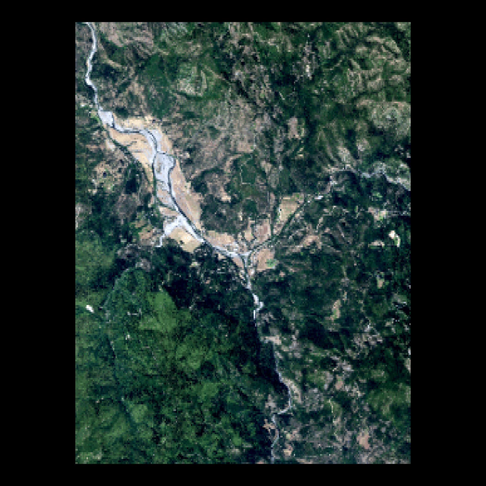

<!-- README.md is generated from README.Rmd. Please edit that file -->

# terrainr: Landscape Visualization in R and Unity <a href='https://docs.ropensci.org/terrainr/'></a>

<!-- badges: start -->

[](https://doi.org/10.21105/joss.04060)
[](https://choosealicense.com/licenses/mit/)
[](https://cran.r-project.org/package=terrainr)
[](https://lifecycle.r-lib.org/articles/stages.html#maturing)
[](https://app.codecov.io/gh/ropensci/terrainr)
[](https://www.repostatus.org/#active)
[](https://github.com/ropensci/terrainr/actions)
[](https://github.com/ropensci/software-review/issues/416)

<!-- badges: end -->

## Overview

terrainr makes it easy to retrieve elevation and base map image tiles
for areas of interest within the United States from the [National Map
family of APIs](https://apps.nationalmap.gov/services), and then process
that data into larger, joined images or crop it into tiles that can be
imported into the Unity 3D rendering engine.

There are three main utilities provided by terrainr. First, users are
able to download data from the National Map via the `get_tiles`
function, downloading data tiles for the area represented by an `sf` or
`Raster` object:

``` r
library(terrainr)
library(sf)

location_of_interest <- tmaptools::geocode_OSM("Hyampom California")$coords

location_of_interest <- data.frame(
  x = location_of_interest[["x"]],
  y = location_of_interest[["y"]]
)

location_of_interest <- st_as_sf(
  location_of_interest, 
  coords = c("x", "y"), 
  crs = 4326
)

location_of_interest <- set_bbox_side_length(location_of_interest, 8000)

output_tiles <- get_tiles(location_of_interest,
                          services = c("elevation", "ortho"),
                          resolution = 30 # pixel side length in meters
                          )
```

Once downloaded, these images are in standard GeoTIFF or PNG formats and
can be used as expected with other utilities:

``` r
raster::plot(raster::raster(output_tiles[["elevation"]][[1]]))
```



``` r
raster::plotRGB(raster::brick(output_tiles[["ortho"]][[1]]), scale = 1)
```



Finally, terrainr helps you visualize this data, both natively in R via
the new `geom_spatial_rgb` geom:

``` r
library(ggplot2)
ggplot() + 
  geom_spatial_rgb(data = output_tiles[["ortho"]],
                   aes(x = x, y = y, r = red, g = green, b = blue)) + 
  coord_sf(crs = 4326) + 
  theme_void()
```



As well as with the Unity 3D rendering engine, allowing you to fly or
walk through your downloaded data sets in 3D and VR:

``` r
with_progress( # When not specifying resolution, default is 1m pixels
  output_tiles <- get_tiles(location_of_interest,
                            services = c("elevation", "ortho"))
)

merged_dem <- merge_rasters(output_tiles[["elevation"]], 
                            tempfile(fileext = ".tif"))
merged_ortho <- merge_rasters(output_tiles[["ortho"]], 
                              tempfile(fileext = ".tif"))

make_manifest(output_tiles$elevation,
              output_tiles$ortho)
```

We can then import these tiles to Unity (following the [Import
Vignette](https://docs.ropensci.org/terrainr/articles/unity_instructions.html))
to create:


The more time intensive processing steps can all be monitored via the
[progressr](https://github.com/HenrikBengtsson/progressr) package, so
you’ll be more confident that your computer is still churning along and
not just stalled out. For more information, check out [the introductory
vignette](https://docs.ropensci.org/terrainr//articles/overview.html)
and [the guide to importing your data into
Unity!](https://docs.ropensci.org/terrainr//articles/unity_instructions.html)

## Citing terrainr

The United States Geological Survey provides guidelines for citing USGS
data products (as downloaded from `get_tiles`) at
<https://www.usgs.gov/faqs/how-should-i-cite-datasets-and-services-national-map>
.

To cite terrainr in publications please use:

> Mahoney, M. J., Beier, C. M., and Ackerman, A. C., (2022). terrainr:
> An R package for creating immersive virtual environments. Journal of
> Open Source Software, 7(69), 4060,
> <https://doi.org/10.21105/joss.04060>

A BibTeX entry for LaTeX users is:

``` bibtex
  @Article{,
    year = {2022},
    publisher = {The Open Journal},
    volume = {7},
    number = {69},
    pages = {4060},
    author = {Michael J. Mahoney and Colin M. Beier and Aidan C. Ackerman},
    title = {{terrainr}: An R package for creating immersive virtual environments},
    journal = {Journal of Open Source Software},
    doi = {10.21105/joss.04060},
    url = {https://doi.org/10.21105/joss.04060},
  }
```

## Available Datasets

The following datasets can currently be downloaded using `get_tiles` or
`hit_national_map_api`:

- [3DEPElevation](https://elevation.nationalmap.gov/arcgis/rest/services/3DEPElevation/ImageServer):
  The USGS 3D Elevation Program (3DEP) Bare Earth DEM.
- [USGSNAIPPlus](https://imagery.nationalmap.gov/arcgis/rest/services/USGSNAIPPlus/ImageServer/exportImage):
  National Agriculture Imagery Program (NAIP) and high resolution
  orthoimagery (HRO).
- [nhd](https://hydro.nationalmap.gov/arcgis/rest/services/nhd/MapServer):
  A comprehensive set of digital spatial data that encodes information
  about naturally occurring and constructed bodies of surface water
  (lakes, ponds, and reservoirs), paths through which water flows
  (canals, ditches, streams, and rivers), and related entities such as
  point features (springs, wells, stream gauges, and dams).
- [govunits](https://carto.nationalmap.gov/arcgis/rest/services/govunits/MapServer):
  Major civil areas for the Nation, including States or Territories,
  counties (or equivalents), Federal and Native American areas,
  congressional districts, minor civil divisions, incorporated places
  (such as cities and towns), and unincorporated places.
- [contours](https://carto.nationalmap.gov/arcgis/rest/services/contours/MapServer):
  The USGS Elevation Contours service.
- [geonames](https://carto.nationalmap.gov/arcgis/rest/services/geonames/MapServer):
  Information about physical and cultural geographic features,
  geographic areas, and locational entities that are generally
  recognizable and locatable by name.
- [NHDPlus_HR](https://hydro.nationalmap.gov/arcgis/rest/services/NHDPlus_HR/MapServer):
  A comprehensive set of digital spatial data comprising a nationally
  seamless network of stream reaches, elevation-based catchment areas,
  flow surfaces, and value-added attributes.
- [structures](https://carto.nationalmap.gov/arcgis/rest/services/structures/MapServer):
  The name, function, location, and other core information and
  characteristics of selected manmade facilities.
- [transportation](https://carto.nationalmap.gov/arcgis/rest/services/transportation/MapServer):
  Roads, railroads, trails, airports, and other features associated with
  the transport of people or commerce.
- [wbd](https://hydro.nationalmap.gov/arcgis/rest/services/wbd/MapServer):
  Hydrologic Unit (HU) polygon boundaries for the United States, Puerto
  Rico, and the U.S. Virgin Islands.

(All descriptions above taken from the [National Map API
descriptions](https://apps.nationalmap.gov/services).)

Note that sometimes these resources go offline, for reasons unrelated to
anything in this package. You can see the current status of these
resources [at this link](https://stats.uptimerobot.com/gxzRZFARLZ).

## Installation

You can install terrainr from CRAN via:

``` r
install.packages("terrainr")
```

Or, if you want the newest patches and features, you can install the
development version of terrainr from
[GitHub](https://github.com/ropensci/terrainr) with:

``` r
# install.packages("devtools")
devtools::install_github("ropensci/terrainr")
```

Be aware that the development version is not stable, and features that
haven’t been published on CRAN may change at any time!

## Code of Conduct

Please note that this package is released with a [Contributor Code of
Conduct](https://ropensci.org/code-of-conduct/). By contributing to this
project, you agree to abide by its terms.

[](https://ropensci.org)
