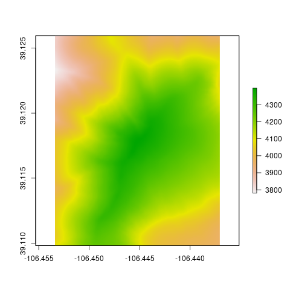
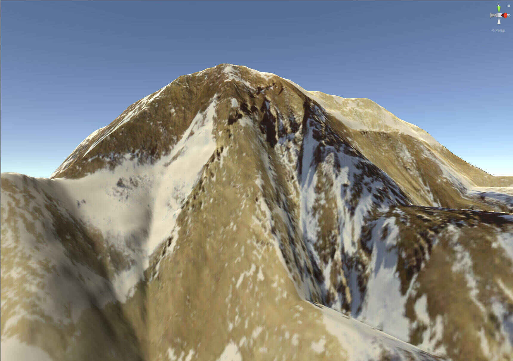

```{r, include = FALSE}
knitr::opts_chunk$set(
  collapse = TRUE,
  comment = "#>"
)
```

The goal of the terrainr package is to make it easy for users to download 
geospatial data from the USGS National Map API and then process that data for 
further analysis, or to produce tiles that can then be imported into the 
Unity 3D rendering engine to be used as physics objects. This vignette will 
walk through the core functions available in terrainr and talk about a few 
quirks of the National Map service and how to work around them.

Let's load the terrainr package to get started:

```{r setup}
library(terrainr)
```

We're going to work with data for Mount Elbert today, the highest point in the 
Rocky Mountain range. I'm just choosing this location for the dramatic scenery;
the National Map can be used to retrieve data for the entire United States and 
much of Canada. Let's simulate some data for the area right around Mt. Elbert,
such as the point data we might get from field data:

```{r}
mt_elbert_points <- data.frame(
  lat = runif(100, min = 39.11144, max = 39.12416),
  lng = runif(100, min = -106.4534, max = -106.437)
)
```

Let's also assign the coordinates for the peak to `mt_elbert`:

```{r}
mt_elbert <- c(39.1178, -106.4452)
```

Our first step is to get the bounding box that contains our data. This is 
where our first terrainr function, `get_coord_bbox`, comes in:

```{r}
mt_elbert_bbox <- get_coord_bbox(data = mt_elbert_points, 
                                 lat = "lat", 
                                 lng = "lng")
mt_elbert_bbox
```

`get_coord_bbox` returns an S4 class (`terrainr_bounding_box`) that indicates 
the "bottom left" and "top right" points of the box containing all your points, 
which is guaranteed to work with all the functions in terrainr. However, there's 
no requirement for you to go out of your way to make a `terrainr_bounding_box` object; any list object that contains the same information will work just as 
well with all of terrainr's processing and data retrieval functions.

We can also calculate a bounding box for our single point:

```{r}
peak_bbox <- get_coord_bbox(lat = mt_elbert[[1]], 
                            lng = mt_elbert[[2]])
peak_bbox
```

But of course, this bounding box doesn't contain anything other than our single 
point! 

If we want, we can extend the bounding box by a set distance using
`add_bbox_buffer()`:

```{r}
add_bbox_buffer(bbox = peak_bbox, 
                distance = 1000,
                distance_unit = "meters")
```

Which, if we only have a single point, can be equivalent to simulating data as
we did above!

```{r}
all.equal(add_bbox_buffer(bbox = peak_bbox, 
                distance = 1000,
                distance_unit = "meters"),
          mt_elbert_bbox,
          tolerance = 0.00001)
```

Now that we've got our bounding box, it's time to retrieve our data. terrainr 
currently supports downloading DEMs from the USGS 3D Elevation Program and 
orthoimages from the National Agricultural Imagery Program. These programs have
slightly different APIs and different restrictions on file types and the size
of image you can download at once. Rather than make you think about this, 
terrainr handles all the weird edges of the API requests for you, including 
splitting your bounding box into tiles and downloading each separately. To make
multi-step processing easier, terrainr functions which deal with these tiles 
typically return lists of the file paths they saved your data to.

For this vignette, we'll retrieve both elevation and orthoimagery using the 
`get_tiles` function. We can either use the generic "elevation" and "ortho"
shorthands to get our data, or we can specify "3DEPElevation" and "USGSNAIPPlus"
to make sure we're using the same specific service -- the short codes aren't
guaranteed to download data from the same service between releases!

One last note -- all the longer-running terrainr functions can print out 
progress bars, if the user requests them via the 
[progressr](https://CRAN.R-project.org/package=progressr) 
package. We'll demonstrate that syntax here:

```{r eval = FALSE}
library(progressr)
handlers("progress")
with_progress(
  output_files <- get_tiles(bbox = mt_elbert_bbox,
                            output_prefix = tempfile(),
                            services = c("elevation", "ortho"))
  )
```

And just like that, we have our data tiles!

```{r eval = FALSE}
output_files
```

```{r echo = FALSE}
output_files <- list(
  `3DEPElevation` = "/tmp/RtmphTFQvZ/file65e5d859e628_3DEPElevation_1_1.tif",
  USGSNAIPPlus = "/tmp/RtmphTFQvZ/file65e5d859e628_USGSNAIPPlus_1_1.tif"
)
output_files
```

```{r eval=FALSE}
raster::plot(raster::raster(output_files[[1]]))
```

```{r echo = FALSE}

```

```{r eval=FALSE}
raster::plotRGB(raster::brick(output_files[[2]]), scale = 1)
```

```{r echo = FALSE}
knitr::include_graphics("example_ortho.png")
```

`output_files` is now a named list with all of our downloaded files! If we were
requesting more data than we can download at once, each element of the list 
would be a character vector containing the file paths for all of our downloaded
tiles. Since we're sticking with a relatively small area for this example, we 
only have one tile for each service.

A weird quirk of this API is that the USGS does not necessarily respect 
the bounding boxes that we ask for, and will download tiles with overlapping
edges. We can fix this using `merge_rasters`:

```{r eval = FALSE}
elevation_merged <- merge_rasters(input_rasters = output_files[1],
                                  output_raster = tempfile(fileext = ".tif"))
ortho_merged <- merge_rasters(input_rasters = output_files[2],
                              output_raster = tempfile(fileext = ".tif"))
```

Now, one other feature of `merge_rasters` is the ability to create georeferenced
rasters from non-georeferenced images. This means that you can turn any image 
into an overlay for your output maps, so long as you've stored it as a PNG -- 
just pass a vector of image files that correspond to the vector of rasters 
you're merging to `input_images` and specify an output file.

This produces two tiles: one merged elevation map and one merged orthoimage, 
both written out as georeferenced TIFFs. `merge_rasters` doesn't actually care
if you want to merge files, though -- as we saw here, if our goal is just to 
georeference an image file, we can provide length 1 vectors to both input 
arguments. This can be combined with `mapply` to georeference all the tiles 
downloaded by `get_tiles` without merging any.

The last major function provided by terrainr is `raster_to_raw_tiles`, which 
is designed to turn these larger rasters into tiles that can be imported into 
the Unity 3D rendering engine. The specifics of working with Unity is outside
of the scope of this overview vignette, other than to demonstrate the main 
way I call `raster_to_raw_tiles`:

```{r eval = FALSE}
side_length <- vapply(c(elevation_merged, ortho_merged), 
                      function(x) max(dim(raster::raster(x))), 
                      numeric(1))

mapply(function(x, y, z) {
  with_progress(
    raster_to_raw_tiles(input_file = x, 
                        output_prefix = "mt_ebert", 
                        side_length = y, 
                        raw = z)
    )
},
  c(elevation_merged, ortho_merged),
  side_length, # What's the longer edge of our image file?
  c(TRUE, FALSE) # we don't want to convert our orthoimages to .raw;
)                # Unity takes the textures as .pngs
```

And after that function runs, it's a matter of minutes to create beautiful -- 
and fully physically-simulated -- landscape visualizations of your area of 
interest:

```{r echo = FALSE}

```

