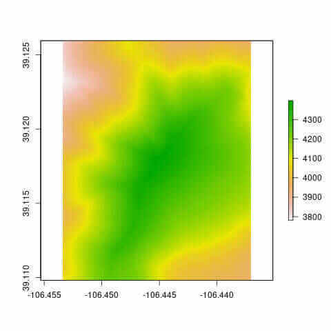
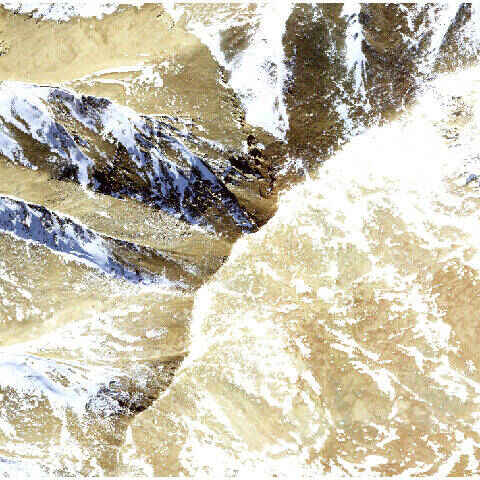
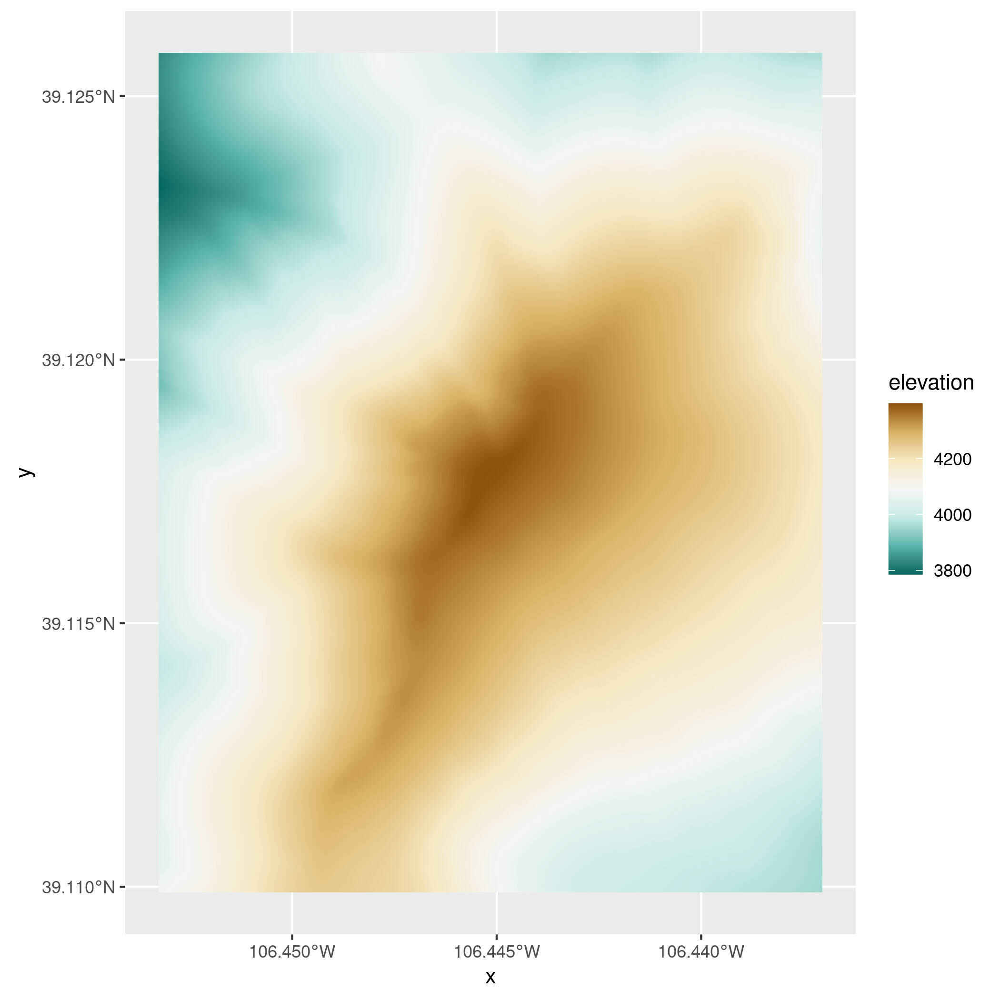
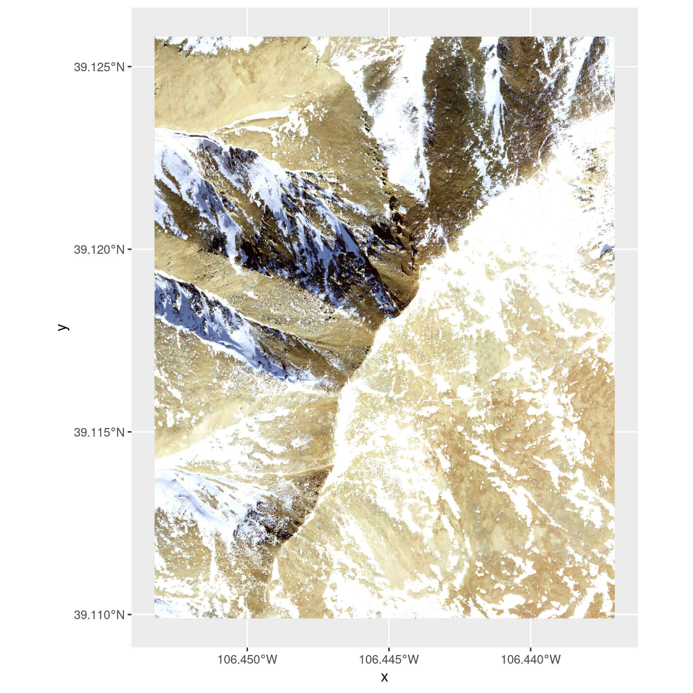
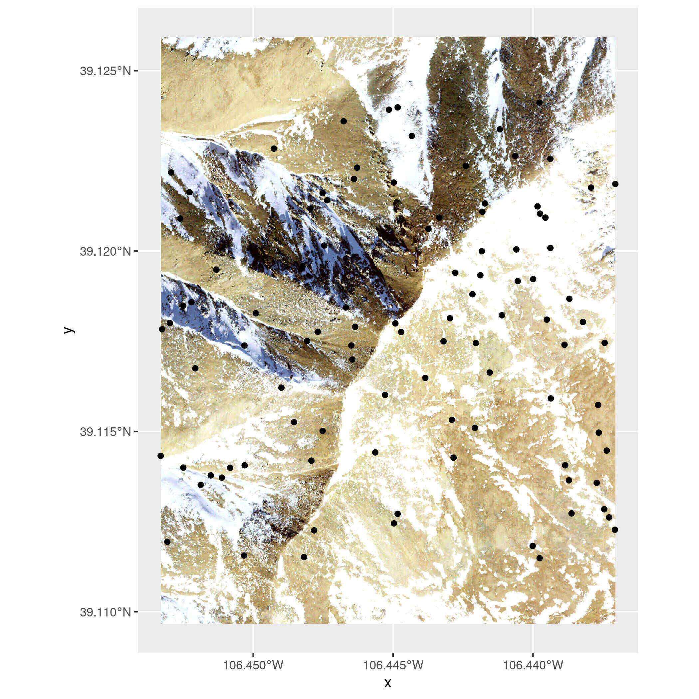
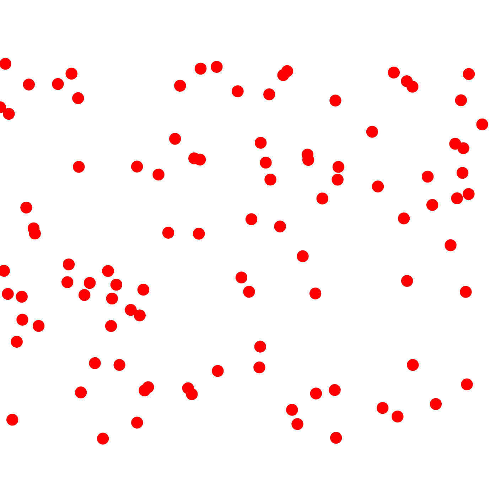
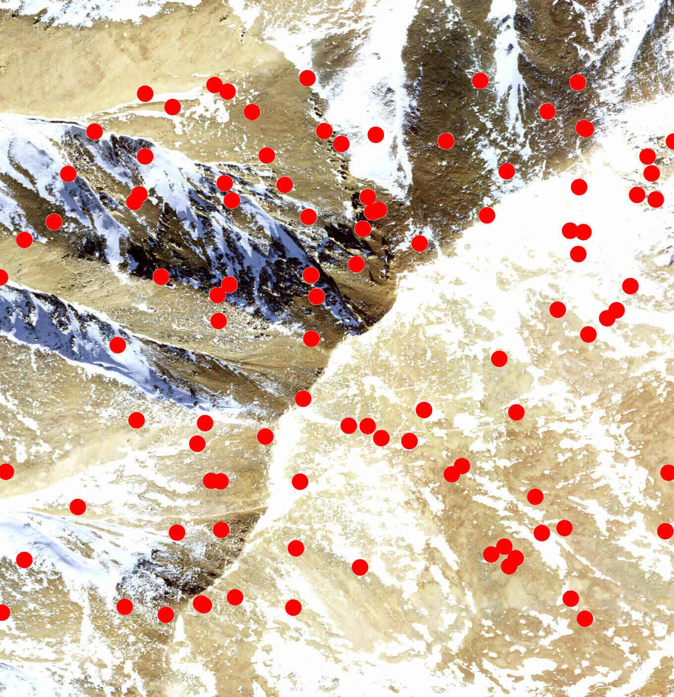

```{r, include = FALSE}
knitr::opts_chunk$set(
  collapse = TRUE,
  comment = "#>"
)
```

The goal of the terrainr package is to make it easier to visualize landscapes,
both by providing functions to download elevation data and base maps from the 
USGS National Map and by adding utilities to manipulate base maps for use in 
visualizations using [ggplot2](https://ggplot2.tidyverse.org/) or the 
freely available [Unity 3D rendering engine](https://unity.com/).
This vignette will walk through the core functions available in terrainr and 
how they interact.

Let's load the terrainr package to get started:

```{r setup}
library(terrainr)
```

We're going to work with data for Mount Elbert today, the highest point in the 
Rocky Mountain range. I'm just choosing this location for the dramatic scenery;
the National Map can be used to retrieve data for the entire United States and 
much of Canada. Let's simulate some data for the area right around Mt. Elbert,
such as the point data we might get from some field collection:

```{r}
mt_elbert_points <- data.frame(
  lat = runif(100, min = 39.11144, max = 39.12416),
  lng = runif(100, min = -106.4534, max = -106.437)
)
```

terrainr is built to play nicely with functions from the 
[sf](https://r-spatial.github.io/sf/) and [raster](https://rspatial.org/raster/) 
packages. In order to get our simulated points into the right format, we need to 
use the `st_as_sf` function from the `sf` package:

```{r}
mt_elbert_points <- sf::st_as_sf(mt_elbert_points,
                                 coords = c("lng", "lat"))
mt_elbert_points <- sf::st_set_crs(mt_elbert_points, 4326)
```

Now that we've got our data in the right format, it's time to retrieve our data. 
terrainr currently supports downloading DEMs from the USGS 3D Elevation Program 
as well as orthoimages from the National Agricultural Imagery Program, in 
addition to other base map images from the National Map. These programs each 
have slightly different APIs and different restrictions on file types and the 
size of image you can download at once. 
Rather than make you think about this, terrainr handles all the edges of making 
API requests for you, including splitting your request into tiles and 
formatting the query. 

For this vignette, we'll retrieve both elevation and orthoimagery using the 
`get_tiles` function. We can either use the generic "elevation" and "ortho"
shorthands to get our data, or we can specify "3DEPElevation" and "USGSNAIPPlus"
to make sure we're using the same specific service -- the short codes aren't
guaranteed to download data from the same service between releases!

One last note -- all the longer-running terrainr functions can print out 
progress bars, if the user requests them via the 
[progressr](https://CRAN.R-project.org/package=progressr) 
package. We'll demonstrate that syntax here:

```{r eval = FALSE}
library(progressr)
handlers("progress")
with_progress(
  output_files <- get_tiles(mt_elbert_points,
                            output_prefix = tempfile(),
                            services = c("elevation", "ortho"))
  )
```

And just like that, we have our data tiles! To make multi-step processing 
easier, terrainr functions which deal with these tiles typically return lists of 
the file paths they saved your data to.

```{r eval = FALSE}
output_files
```

```{r echo = FALSE}
output_files <- list(
  elevation = "/tmp/RtmphTFQvZ/file65e5d859e628_3DEPElevation_1_1.tif",
  ortho = "/tmp/RtmphTFQvZ/file65e5d859e628_USGSNAIPPlus_1_1.tif"
)
output_files
```

If we were requesting more data than we can download at once, each element of 
the list would be a character vector containing the file paths for all of our 
downloaded tiles. Since we're sticking with a relatively small area for this 
example, we only have one tile for each service. 

As a quick aside, note that 
you can control where these files save to via the `output_prefix` argument 
(which appends the suffix `servicename_xindex_yindex.tif` to each tile it 
downloads) -- you don't need to save them to a temporary directory (and 
redownload every time you launch R) as we're doing here!

If all you want is to access these endpoints to download data, this is probably
the only terrainr function you'll need -- the files produced by this function
can be processed just like any other spatial data:

```{r eval=FALSE}
raster::plot(raster::raster(output_files[[1]]))
```

```{r echo = FALSE}

```

```{r eval=FALSE}
raster::plotRGB(raster::brick(output_files[[2]]), scale = 1)
```

```{r echo = FALSE}

```

In addition to the regular methods for plotting rasters in R, terrainr makes it 
a bit easier to use ggplot2 for plotting the data returned by `get_tiles`. 
Plotting single-band rasters, like our elevation file, is already well-supported
in base ggplot2:

```{r eval=FALSE}
library(ggplot2)

elevation_raster <- raster::raster(output_files[[1]])
elevation_df <- as.data.frame(elevation_raster, xy = TRUE)
elevation_df <- setNames(elevation_df, c("x", "y", "elevation"))

ggplot() + 
  geom_raster(data = elevation_df, aes(x = x, y = y, fill = elevation)) + 
  scale_fill_distiller(palette = "BrBG") + 
  coord_sf(crs = 4326)
```

```{r echo = FALSE}

```

terrainr adds the ability to plot using multi-band RGB rasters, like the tiles
downloaded for non-elevation endpoints, using the new `geom_spatial_rgb`
function (or its partner, `stat_spatial_rgb`):

```{r eval = FALSE}
ortho_raster <- raster::stack(output_files[[2]])
ortho_df <- as.data.frame(ortho_raster, xy = TRUE)
ortho_df <- setNames(ortho_df, c("x", "y", "red", "green", "blue", "alpha"))

ggplot() + 
  geom_spatial_rgb(data = ortho_df,
                   # Required aesthetics r/g/b specify color bands:
                   aes(x = x, y = y, r = red, g = green, b = blue)) + 
  coord_sf(crs = 4326)
```

```{r}

```


Note that `geom_spatial_rgb` is a little different from other ggplot2 geoms in 
that it can also accept RasterStack objects directly:

```{r eval = FALSE}
ggplot() + 
  geom_spatial_rgb(data = ortho_raster,
                   aes(x = x, y = y, r = red, g = green, b = blue)) + 
  coord_sf(crs = 4326)
```

```{r echo = FALSE}

```

Or length 1 character vectors with a path to a file that can be read by 
`raster::stack`:

```{r eval = FALSE}
ggplot() + 
  geom_spatial_rgb(data = output_files[[2]],
                   aes(x = x, y = y, r = red, g = green, b = blue)) + 
  coord_sf(crs = 4326)
```

```{r echo = FALSE}

```

You can then use these multi-band rasters as base maps for further plotting as 
desired.

```{r eval = FALSE}
ggplot() + 
  geom_spatial_rgb(data = output_files[[2]],
                   aes(x = x, y = y, r = red, g = green, b = blue)) + 
  geom_sf(data = mt_elbert_points)
```

```{r echo = FALSE}

```

In case you find this visualization falls a little bit flat, terrainr also 
provides the ability to bring your landscapes into Unity to visualize in 3D. 
Our first step in this process is going to be replicating our image of 
base-map-plus-field-sites (above) in a format that we can import into Unity 
directly. First, we'll need to use the `vector_to_overlay` function to create
an image overlay from our point data:

```{r, eval = FALSE}
mt_elbert_overlay <- vector_to_overlay(mt_elbert_points,
                                       output_files[[2]],
                                       size = 15,
                                       color = "red")
knitr::include_graphics(mt_elbert_overlay)
```

```{r, echo = FALSE}

```

Note that `vector_to_overlay` can be used with any sf object, not just point 
data.

These overlays may be stacked on top of one another or downloaded imagery using
the `combine_overlays` function:

```{r, eval=FALSE}
ortho_with_points <- combine_overlays(
  # Overlays are stacked in order, with the first file specified on the bottom
  output_files[[2]],
  mt_elbert_overlay,
  output_file = tempfile(fileext = ".png")
  )
knitr::include_graphics(ortho_with_points)
```

```{r, echo = FALSE}

```

Unfortunately, this image processing strips the georeferencing on the image. 
We can restore the original georeferencing via the `georeference_overlay`
function:

```{r eval = FALSE}
georef_overlay <- georeference_overlay(
  ortho_with_points,
  output_files[[2]]
)
```

We've been working so far with a single tile, but Unity is able to handle much,
much larger rasters than we would normally work with in R. In order to create
overlays for these larger rasters, it's usually best to create an overlay for
smaller image tiles which can then be joined back together with `merge_rasters`:

```{r, eval = FALSE}
tile_overlays <- lapply(output_files[[2]],
                        function(x) vector_to_overlay(mt_elbert_points, 
                                                      x, 
                                                      size = 15, 
                                                      color = "red", 
                                                      na.rm = TRUE))

combined_tiles <- mapply(function(x, y) {
  combine_overlays(x, y, output_file = tempfile(fileext = ".png"))
  },                            
  output_files[[2]],
  tile_overlays)

georef_tiles <- mapply(georeference_overlay, combined_tiles, output_files[[2]])

merged_tiles <- merge_rasters(georef_tiles)
```

Of course, since we're only working with a single tile, `georef_tiles` is 
identical to `merged_tiles`. But when working with larger areas, `merged_tiles`
is particularly useful for joining the separate tiles downloaded by `get_tiles`
into a single raster file.

In particular, having a single joined raster is necessary for the function
`raster_to_raw_tiles`, which is designed to turn these larger rasters into tiles 
in a format that can be imported into the Unity 3D rendering engine. The 
specifics of working with Unity is outside of the scope of this overview 
vignette, other than to demonstrate the main way I call `raster_to_raw_tiles`:

```{r eval = FALSE}
elevation_tile <- output_files[[1]]
side_length <- vapply(c(elevation_tile, georef_tiles), 
                      function(x) max(dim(raster::raster(x))), 
                      numeric(1))

mapply(function(x, y, z) {
  with_progress(
    raster_to_raw_tiles(input_file = x, 
                        output_prefix = "mt_ebert", 
                        side_length = y, 
                        raw = z)
    )
},
  c(elevation_tile, georef_tiles),
  side_length, # What's the longer edge of our image file?
  c(TRUE, FALSE) # we don't want to convert our orthoimages to .raw;
)                # Unity takes the textures as .jpgs
```

And after that function runs, it's a matter of minutes to create beautiful -- 
and fully physically-simulated -- landscape visualizations of your area of 
interest in Unity:

```{r echo = FALSE}
knitr::include_graphics("ebert_unity.jpg")
```

For more instructions on how to create these 3D simulations in Unity, check out
the [Unity vignette](https://docs.ropensci.org/terrainr/articles/unity_instructions.html).
