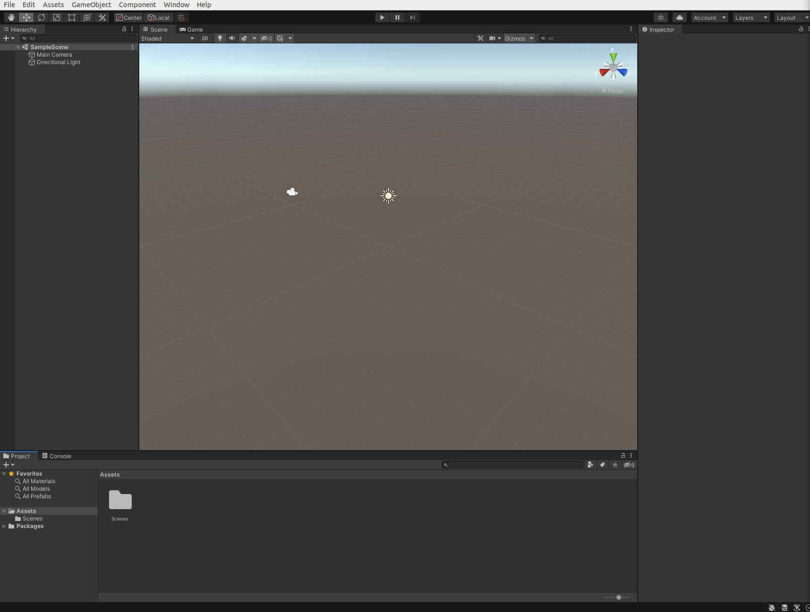

```{r, include = FALSE}
knitr::opts_chunk$set(
  collapse = TRUE,
  comment = "#>"
)
```

One of the key functions of terrainr is `raster_to_raw_tiles`, which takes TIFF
files and converts them into formats that can be used to create interactive 
landscape visualizations in the [Unity rendering engine](https://unity.com/). 
This tutorial assumes you have already downloaded Unity.

This is the entirety of the R code that we'll be running today; most of this 
tutorial will be focusing on using Unity. If you aren't familiar with the 
functions being used in this chunk, check out the [introductory vignette!](https://mikemahoney218.github.io/terrainr/articles/overview.html)

```{r, eval = FALSE}
library(terrainr)
library(magrittr)

# This will get us data for a 16 km2 area centered on Mt. Marcy,
# in the Adirondack State Park of New York 
raw_tiles <- data.frame(id = seq(1, 100, 1),
                        lat = runif(100, 44.04905, 44.17609), 
                        lng = runif(100, -74.01188, -73.83493)) %>% 
  get_coord_bbox(lat = "lat", lng = "lng") %>% 
  get_tiles(., services = c("elevation", "ortho"))

merged_outputs <- merge_rasters(raw_tiles$`3DEPElevation`, 
                                tempfile(fileext = ".tif"), 
                                .$USGSNAIPPlus, 
                                tempfile(fileext = ".tif"))

mapply(function(x, y) raster_to_raw_tiles(input_file = x, 
                                          output_prefix = "mt_marcy", 
                      # This is the maximum side length we can import to Unity
                                          side_length = 4097, 
                                          raw = y),
       merged_outputs,
       c(TRUE, FALSE))
```

The one thing I'll point out in the code is that we're providing two sets of 
arguments to each of our `raster_to_raw_tiles` runs: first we provide a 
heightmap with the argument `raw = TRUE`, then we rerun the function with our
orthoimage and `raw = FALSE`. The reason here is that we'll import these objects
into Unity differently, so they need to be saved out in different file formats.

Once that code finishes running, you should have about this many files:

```{r echo=FALSE}
knitr::include_graphics("files.jpg")
```

We can safely ignore or delete all the XML files. Additionally, you'll notice 
that you have 3 black PNG files, which are only a few kB in size (versus the 
roughly 75 MB average of the other files). Our input files weren't exactly 
evenly divisible by 4097, so the few extra pixels at the end got split into 
their own files; feel free to delete those (and their matching .raw 
counterparts) as well.

So now we're down to 16 files. Let's go ahead and open a new Unity project now:

```{r echo=FALSE}
knitr::include_graphics("new_unity.jpg")
```

Which will spit us out into a brand new scene. Note that you can fly around in 
the scene by right-clicking and using WASD to navigate, and you can fly faster
by holding shift at the same time.

```{r echo=FALSE}

```

Under "Game Object" in the top menu bar, go into the "3D Object" submenu and 
then click "Terrain" to add a new, blank terrain object to our scene. While the
terrain is selected (indicated by an orange border; if it isn't selected, just
click on it) click the "Terrain Settings" menu (the gear icon on the far right) 
in the "Inspector" menu in the right-hand pane.

Almost all the way at the bottom of "Terrain Settings" is the "Import Raw" 
button. By clicking that and then selecting our first heightmap -- let's start
with `mt_marcy_1_1.raw` -- we can start importing it into Unity. Set resolution,
X, and Z to the side_length argument in `raster_to_raw_tiles`, and Y to the 
maximum elevation across all your tiles -- if you don't know it, you can find it
via `raster::cellStats(raster::raster("your_merged_heightmap.tif"), "max)`. In 
our case, it's about 1629.

```{r echo=FALSE}
knitr::include_graphics("heightmap_import.jpg")
```

Hit "Import" and voila, you have a terrain tile! 

To import the rest, we first need to create new terrain objects. I do this by 
going to the "Create Neighbor Terrains" menu (under Inspector, the icon of 
mountains with a plus sign all the way to the left) and adding terrain from 
there.

The trick here is that, when the red "X" cone points straight left and the blue
"Z" cone points straight down, tiles are named following the format 
`prefix_x_y.raw` where `x` and `y` are the tile's position in a grid. Our 
`mt_marcy_1_1.raw` tile is the top left of the grid, with the rest of the tiles
being arranged as so:

```{r echo=FALSE}
knitr::include_graphics("tile_arrangement.jpg")
```

You'll have to re-input the resolution for each tile, but X, Y, and Z stay the 
same. Go ahead and import the rest of our tiles.

Once all your tiles are imported, right click in the "Assets" pane at the bottom
of the page and select "Import New Asset". Go ahead and import all of the 9 PNG
files we produced earlier.

Now select that (1,1) terrain tile and go to the "Paint Terrain" menu in the 
Inspector, next to the Create Neighbor Terrain menu. Under "Edit Terrain 
Layers", click "Create Layer". The image tiles are named following the same 
pattern as the elevation tiles, so go ahead and select the (1,1) image. Double
click the image to confirm.

```{r echo=FALSE}
knitr::include_graphics("create_layer.jpg")
```

Back in the Inspector, click the image that appeared under "Terrain Layers" and 
then update the Size values to the same side length as the elevation tiles. This
will stretch the texture out so it drapes properly over the landscape.

```{r echo=FALSE}
knitr::include_graphics("resize_layer.jpg")
```

You'll want to repeat this for each tile -- but make sure you click off the tile
you just painted before clicking the next one! Otherwise, you'll paint that tile
with the same orthoimage as you just applied; to undo this, click the offending
image under Terrain Layers, then "Edit Terrain Layers," then "Remove Layer".

And just like that, your map is painted! You're now able to fly through your 
creation or use the rest of Unity's features to turn your landscape into a 
full 3D experience.

```{r echo=FALSE}
knitr::include_graphics("finished.jpg")
```

```{r echo=FALSE}
knitr::include_graphics("finished_again.jpg")
```
