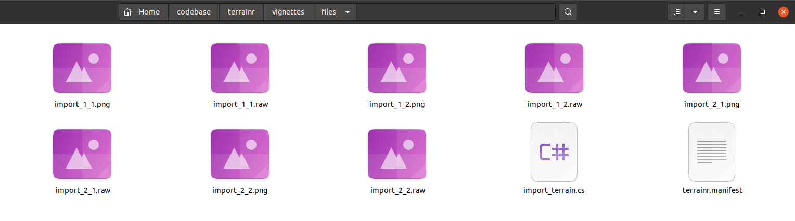
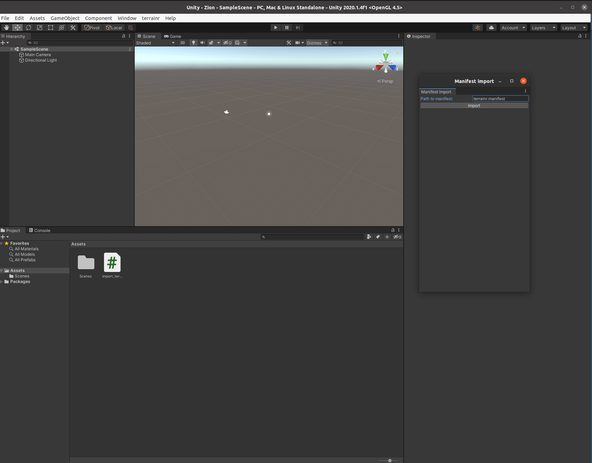

```{r, include = FALSE}
knitr::opts_chunk$set(
  collapse = TRUE,
  comment = "#>"
)
```

terrainr advertises itself as a package for landscape visualization in R and 
[Unity](https://unity.com/). This vignette focuses on the Unity half of the 
equation -- specifically, on how to mostly-automatically import tiles into 
Unity. If you're interested in the R half of the package, refer to 
(the overview vignette)[overview.html]. Note that this vignette will assume you 
already have Unity installed on your computer.

In order to import terrain tiles into Unity, we will first need to have some 
data worth importing! For the purposes of this vignette, we'll be using data 
from the USGS National Map downloaded using `get_tiles`, but note that you can
use _any_ raster data for this process.

First things first, I'm going to use the `geocode_OSM` function from `tmaptools` 
to get the latitude and longitude of Zion National Park, out in Utah. We'll use
this area for our visualization today:

```{r, eval = FALSE}
zion <- tmaptools::geocode_OSM("Zion National Park")$coords
```

Our `zion` object now contains the x and y coordinates for a spot near the 
middle of Zion National Park. Let's go ahead and turn that into an `sf` object,
then use `set_bbox_side_length` to add a buffer around the point coordinates -- 
we'll download data for the entire 8 kilometer square around the central point:

```{r, eval = FALSE}
library(terrainr)
library(sf)
library(magrittr)

zion <- data.frame(x = zion[["x"]], y = zion[["y"]]) %>% 
  st_as_sf(coords = c("x", "y"), crs = 4326) %>% 
  set_bbox_side_length(8000)
```

And now we can go ahead and download data for our area of interest, then merge 
the downloaded tiles into individual rasters. For more on this process or what
these functions do, check out (the overview vignette)[overview.html]. 

Fair warning -- downloading this amount of data can take a bit of time! You can
optionally add a progress bar to the `get_tiles` download by calling 
`library(progressr)` and then `handlers(global = TRUE)` before running this 
code.

```{r, eval = FALSE}
merged_tiles <- zion %>%
  get_tiles(services = c("elevation", "ortho")) %>% 
  lapply(merge_rasters)
```

We've now got our data downloaded! Our next step is to turn it into a data 
format we can import into Unity.

As of terrainr 0.5.0, the way to do this is via the function `make_manifest`. 
The first argument to this function is the elevation raster you want to use as
a heightmap -- in our case, `merged_tiles$elevation`. The second argument 
optionally takes the image overlay you want to put on top of that heightmap. 
In our case, that means everything we need to provide is in the `merged_tiles`
list:

```{r, eval = FALSE}
make_manifest(merged_tiles$elevation, 
              merged_tiles$ortho)
```

After a moment, this function will spit out a number of files: our heightmap and
overlay tiles, all prefixed with `import_`, a C# file named `import_terrain.cs`,
and a final file named `terrainr.manifest` (note that all of these names can be 
changed via arguments to `make_manifest`, but for simplicity's sake I'm using 
the default names now). 

```{r, echo = FALSE}

```

Now go ahead and open Unity. From the main "Hub" menu, click "New" to create a
new project. Set the project name to whatever you want, then click "Create".

```{r, echo = FALSE}

```

Go ahead and move all the files from `make_manifest` into the root directory of
your new Unity project. Then move the `import_terrain.cs` file into the `Assets`
directory inside that folder (but leave everything else in the root directory!).

Go back to Unity now. A second after you click into the window, you should 
notice a "terrainr" menu appear in the top bar. Click that menu, then the only
option in the drop-down. A menu should appear; click "Import" to import your 
tiles into Unity.

```{r, echo = FALSE}

```

The importer menu will disappear, then Unity will take a minute or two to import
all your tiles. Depending on your data, you may see something that looks like
this:

```{r, echo = FALSE}

```

That's perfectly fine! Right click on the "Scene" window in the middle, and then
press and hold "S" on your keyboard to move the camera back. After a 
second, you should see your terrain surface!

```{r, echo = FALSE}
knitr::include_graphics("terrain_surface.jpg")
```

You can now move around your surface by right clicking on the image and moving
around with the W-A-S-D keys on your keyboard. Note that your movement speed 
starts off very slow, and then accelerates over time.

And ta-da, you have a surface in Unity! You can go ahead and customize the scene
further (I'll usually then click on "Directional Light" and change "Render Mode" 
to "Not Important" and "Shadow Type" to "No Shadows"), fly around and across
the scene, or do whatever else you want!


